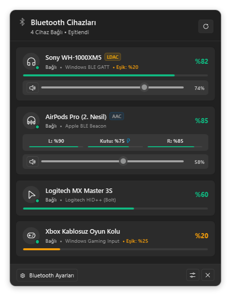
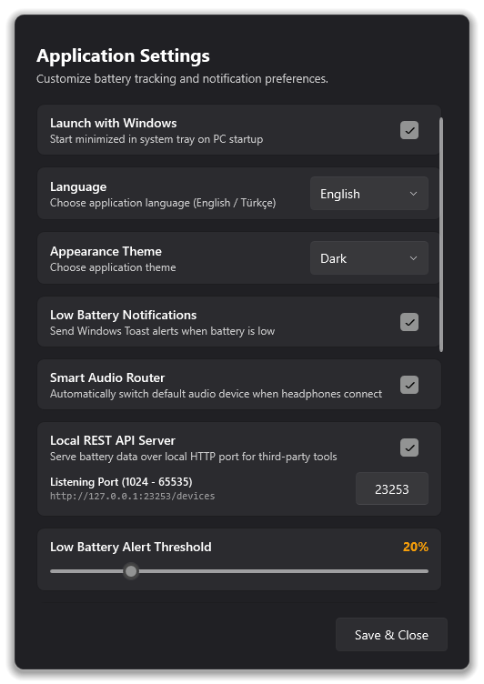
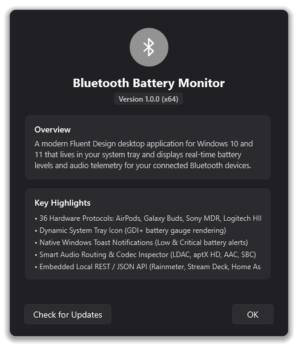
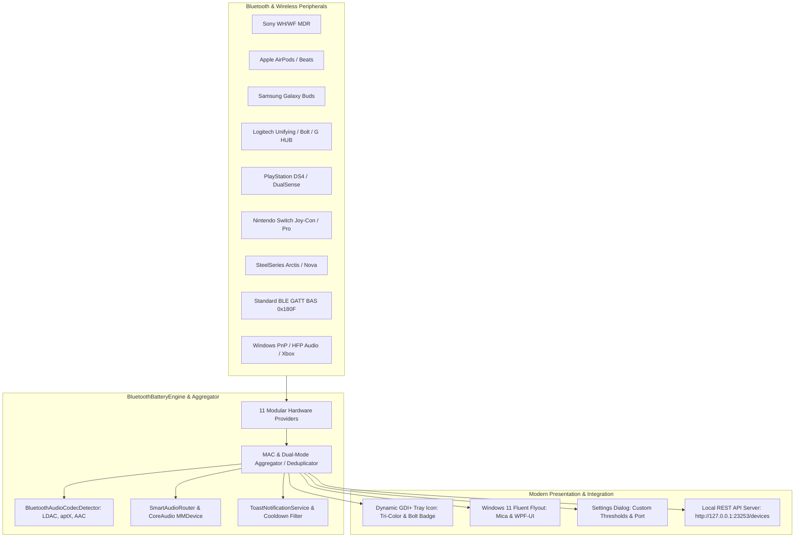

# 🎧 Bluetooth Battery Monitor for Windows

<div align="center">

[](https://github.com/Kaandonmez/BluetoothBatteryMonitor/actions)
[](https://github.com/Kaandonmez/BluetoothBatteryMonitor/releases/latest)
[-blueviolet?style=for-the-badge&logo=windows&logoColor=white)](https://github.com/Kaandonmez/BluetoothBatteryMonitor/releases/latest)
[](https://dotnet.microsoft.com/)
[](https://microsoft.com/windows)
[](https://github.com/lepoco/wpfui)
[](https://github.com/Kaandonmez/BluetoothBatteryMonitor/actions)
[]()
[]()
[](https://github.com/Kaandonmez/BluetoothBatteryMonitor/stargazers)
[](CONTRIBUTING.md)
[](LICENSE)
[](CODE_OF_CONDUCT.md)

**A modern, native Fluent Design desktop application for Windows 10 and Windows 11 that lives in your system tray and provides real-time battery telemetry, audio codec detection, smart routing, and low-power notifications for all your connected Bluetooth and wireless devices.**

[⬇️ Download](#-download--quick-start) •
[Key Features](#-key-features) •
[Screenshots](#-screenshots) •
[Supported Protocols (36 Families)](#-supported-hardware-protocols--device-catalog) •
[Architecture](#-project-architecture) •
[Local REST API](#-local-rest-api) •
[Roadmap](#-roadmap) •
[How to Contribute](#-how-to-contribute)

</div>

---

## ⬇️ Download & Quick Start

Get the latest official release for Windows 10 & 11 (64-bit):

| Package | Description | Download Link |
|:---|:---|:---|
| 📦 **Windows Setup Installer** *(Recommended)* | Modern setup wizard with Start Menu, Desktop shortcuts, auto-start option, and clean uninstaller | [**Download BluetoothBatteryMonitor-Setup-v1.0.1.exe**](https://github.com/Kaandonmez/BluetoothBatteryMonitor/releases/latest) |
| 🚀 **Standalone Executable** | Single `.exe` ready to run without installation | [**Download BluetoothBatteryMonitor.App.exe**](https://github.com/Kaandonmez/BluetoothBatteryMonitor/releases/latest) |
| 🗜️ **Portable Zip Package** | Full portable distribution archive | [**Download BluetoothBatteryMonitor-win-x64.zip**](https://github.com/Kaandonmez/BluetoothBatteryMonitor/releases/latest) |

> **Requirements:** Windows 10 (Version 2004+) or Windows 11, with [.NET 8.0 Desktop Runtime](https://dotnet.microsoft.com/download/dotnet/8.0).
> 
> 💡 *Upgrades preserve all your existing settings, device thresholds, and language preferences automatically in `%APPDATA%\BluetoothBatteryMonitor\`.*

---

## 📸 Authentic Application Screenshots

> *All screenshots below are captured directly from the live running Windows 11 WPF application (`--capture-screenshots`) with real telemetry rendering — never AI mockups.*

<div align="center">
  <table>
    <tr>
      <td align="center" width="50%">
        <b>Fluent Design Flyout (Taskbar Docked)</b><br/><br/>
        
        <br/><br/>
        <em>Real-time battery percentage, TWS (L/R/Case) status, audio codec badge, and volume slider.</em>
      </td>
      <td align="center" width="50%">
        <b>Application & Notification Settings</b><br/><br/>
        
        <br/><br/>
        <em>Custom battery alert thresholds, auto audio switching, and local REST API configuration.</em>
      </td>
    </tr>
    <tr>
      <td colspan="2" align="center">
        <b>About & Telemetry Diagnostics Window</b><br/><br/>
        
        <br/><br/>
        <em>Version info, open-source MIT license, hardware protocol summary, and repository links.</em>
      </td>
    </tr>
  </table>
</div>

---

## ✨ Key Features

- 🔋 **Dynamic GDI+ System Tray Icon:**
  - Automatically calculates and renders the lowest battery level among all connected devices directly into the Windows taskbar tray icon.
  - Intelligent tri-color gauge:
    - 🟢 **100% – 40%**: Vibrant Green (Healthy)
    - 🟡 **39% – 20%**: Amber / Warning (Low)
    - 🔴 **< 20%**: Critical Red (Immediate attention required)
  - ⚡ Distinct charging bolt overlay badge when a device is plugged in or charging.
  - Left-click to seamlessly toggle the Flyout; right-click for a native context menu with quick controls.

- 🪟 **Native Windows 11 Fluent Flyout Window:**
  - Built with [WPF-UI](https://github.com/lepoco/wpfui), featuring native **Mica / Acrylic** backdrop materials, rounded corners (`DwmSetWindowAttribute`), and drop shadow.
  - **Dynamic Taskbar Alignment:** Automatically detects the position of the Windows taskbar (Bottom, Top, Left, or Right) and anchors the flyout with precise multi-monitor coordinates via `TaskbarPositionHelper`.
  - **Smart Focus Dismissal:** Automatically fades out smoothly when clicking outside the window (`Deactivated`), while staying open during sub-menu or slider interactions.
  - **Individual TWS Earbud & Case Monitoring:** Displays separate battery gauges for Left Bud, Right Bud, and Charging Case (AirPods, Galaxy Buds, Pixel Buds, Sony WF series).

- 🧠 **Multi-Layer Battery Telemetry Engine (11 Modular Native Providers):**
  1. **Standard Windows BLE GATT:** Direct GATT notification subscription (`CCCD 0x2902`) on Battery Service `0x180F` and Characteristic `0x2A19`.
  2. **Apple AirPods & Beats Beacon Sniffer:** Background listener for Apple Manufacturer ID `0x004C` and Proximity Beacons, unpacking 4-bit nibbles for independent Left, Right, and Case battery levels.
  3. **Windows PnP & Hands-Free Audio:** Discovers speakers (JBL, Mifa, etc.), headsets, and Xbox controllers via `DEVPKEY_Device_BatteryLevel` and `System.Devices.BatteryLevel`.
  4. **Logitech HID++ (1.0 & 2.0):** Native HID communication for Unifying & Bolt peripherals, reading Feature `0x1000` (Battery Status) and Feature `0x1004` (Unified Battery).
  5. **Logitech G HUB (LIGHTSPEED):** Real-time WebSocket bridge (`ws://127.0.0.1:9010`) syncing G Pro, G502, G915, and other LIGHTSPEED gaming gear instantly.
  6. **Sony PlayStation Controllers (HID Telemetry):** Activates Bluetooth HID telemetry mode for Sony DualShock 4 (Report `0x11`) and PS5 DualSense (Report `0x31`) for live battery and cable charging state.
  7. **Samsung Galaxy Buds (RFCOMM SPP):** Parses Samsung's `0xFD` SOM RFCOMM SPP protocol to extract individual Left, Right, and Case telemetry.
  8. **Sony Headphones Connect (RFCOMM SPP):** Reverse-engineered Sony MDR protocol (`0x0C` SOM) for WH-1000XM3/XM4/XM5 and WF-1000 series.
  9. **Google Fast Pair Service (GFPS 0xFE2C):** Unpacks BLE `0xFE2C` Service Data packets for Android Fast Pair compatible devices.
  10. **Nintendo Switch Controllers (HID Telemetry):** Reads Joy-Con (L/R) and Switch Pro Controller HID Input Reports `0x21`, `0x30`, `0x31`, and `0x3F`.
  11. **SteelSeries Arctis & Nova (HID Telemetry):** Queries USB/BT HID telemetry reports (`0xB0` and `0x00`) for Arctis 7/9/Pro and Nova series.

- 🔔 **Smart Notifications & Battery Safeguards:**
  - Native Windows Toast notifications triggered when battery drops below Low (default 20%) or Critical (default 10%) thresholds.
  - **Per-Device Custom Thresholds:** Set different alert limits for specific devices (e.g., alert at 30% for high-drain wireless mice).
  - **30-Minute Cooldown Filter:** Prevents annoying notification spam.
  - **Power Efficiency:** Automatically pauses polling when the Windows workstation is locked (`SessionLock`) and resumes on unlock.

- 🎵 **Smart Audio Routing & Codec Inspector:**
  - Automatic default audio playback device switching when Bluetooth headphones/speakers connect.
  - Real-time audio codec detection badge: **LDAC**, **aptX Adaptive**, **aptX HD**, **aptX**, **AAC**, **LC3**, or **SBC**.
  - Integrated live volume slider on each device card.

- 🌐 **Built-in Local REST API Server:**
  - Embedded zero-dependency HTTP server (`http://127.0.0.1:23253/devices`) with full CORS support for Rainmeter skins, Stream Deck plugins, Home Assistant, or web dashboards.

- 🔄 **Built-in Update Checker & Settings Preservation:**
  - One-click GitHub Releases update verification right from the **Settings** and **About** windows.
  - Direct download links for new versions with changelog preview.
  - **Zero Settings Loss Guarantee:** Application configuration, alert thresholds, and language preferences are safely stored in `%APPDATA%\BluetoothBatteryMonitor\settings.json` and persist seamlessly across all updates and installer upgrades.

- 📦 **Professional Windows Installer (Inno Setup):**
  - Includes a dedicated modern x64 Setup Wizard (`BluetoothBatteryMonitor-Setup-vX.Y.Z.exe`) supporting English and Turkish languages.
  - Configures Start Menu shortcuts, optional Desktop shortcut, and clean uninstaller in Windows Settings / Control Panel.
  - Automatically handles upgrading running instances cleanly without touching user preferences.

- ⚡ **Single Instance Architecture:**
  - Enforces a single running instance via system-wide `Mutex`. Launching a second instance signals `EventWaitHandle` to immediately bring the existing flyout window to the foreground.

---

## 📡 Supported Hardware Protocols & Device Catalog

The battery engine implements and decodes **36 hardware communication protocols** across Bluetooth Low Energy (BLE), Bluetooth Classic (RFCOMM/SPP), USB HID, and local IPC services:

| # | Protocol / Device Family | Transport Layer | Identifier / UUID | Packet Structure & Decoding Logic | Supported Devices & Examples |
|:--|:---|:---|:---|:---|:---|
| **1** | **Standard BLE Battery Service (BAS)** | BLE GATT | Service `0x180F`, Char `0x2A19` | 1-byte `uint8` direct battery percentage (0–100%). Subscribes to CCCD (`0x2902`) notifications. | All standard BLE mice, keyboards, styluses, and sensors. |
| **2** | **Apple AirPods & Beats Proximity Beacon** | BLE Adv / Beacon | Company ID `0x004C`, Type `0x07` | 27-byte manufacturer payload. 4-bit nibble decoding for Left (L), Right (R), Case battery levels and charging bits. | AirPods 1/2/3/4, AirPods Pro 1/2, AirPods Max, Beats Fit Pro, Powerbeats Pro. |
| **3** | **Apple Magic HID (GATT / PnP)** | BLE GATT / HID | `0x004C`, HID Input Report | Direct battery report parsing or Windows PnP `DEVPKEY_Device_BatteryLevel`. | Apple Magic Mouse 2, Magic Trackpad 2, Magic Keyboard (including Touch ID). |
| **4** | **Bluetooth Hands-Free (HFP 1.5+)** | BT Classic RFCOMM | AT Command Set | `AT+BIEV=2,<level>` (HF Indicators) or Apple HFP extension `AT+XAPL` / `+IPHAC` (0–9 or 0–10 scale). | Bluetooth car kits, wireless mono/stereo headsets, hands-free speakers. |
| **5** | **Bluetooth AVRCP 1.4+** | BT Classic AVCTP | Profile `0x110E`, Notification `0x0C` | `REGISTER_NOTIFICATION` (`EVENT_BATTERY_STATUS_CHANGED`). Status: 0=Normal, 1=Warning, 2=Critical, 3=Full, 4=Charging. | Car infotainment systems, wireless audio receivers, portable speakers. |
| **6** | **Logitech HID++ 1.0** | HID / 2.4GHz / BT | SubID `0x0D` (Short Register) | 3 bytes: `[0x10, DevIndex, 0x0D]`. Register `0x0D` bitmask for battery voltage/percentage & charging flags. | MX Master (1st Gen), MX Anywhere, Marathon M705, legacy Unifying devices. |
| **7** | **Logitech HID++ 2.0 (Feature 0x1000)** | HID Feature Report | Feature `0x1000` (Battery Status) | Function `0x00` (`GetBatteryLevel`): Level (0–100%), Status (`0x00`=Discharging, `0x01`=Charging, `0x02`=Full). | MX Master 2S / 3 / 3S, MX Keys, Craft, ERGO K860, MX Vertical. |
| **8** | **Logitech HID++ 2.0 (Feature 0x1004)** | HID Feature Report | Feature `0x1004` (Unified Battery) | Unified battery standard: percentage level with Critical / Low / Good / Charging telemetry flags. | Modern Logitech G and MX series Unifying & Logi Bolt peripherals. |
| **9** | **Logitech G HUB (LIGHTSPEED)** | Local WebSocket | `ws://127.0.0.1:9010` | JSON-RPC WebSocket stream. `/devices/list` inventory discovery, `/battery/state/changed` real-time push events. | G Pro Wireless, Pro X Superlight 1/2, G502 LIGHTSPEED, G915, G733, G703. |
| **10** | **Sony DualShock 4 Controller** | BT / USB HID | `VID_054C`, `PID_05C4` / `09CC` | Output Report `0x11` activates telemetry mode. Input Report `0x11` Byte 30: Lower 4-bits (0–10 -> 0–100%), Bit 4 (`0x10`=Cable Charging). | Sony PS4 DualShock 4 (v1, v2, and USB Wireless Adapter). |
| **11** | **Sony DualSense & Edge (PS5)** | BT / USB HID | `VID_054C`, `PID_0CE6` / `0DF2` | Output Report `0x31` switches telemetry. Input Report `0x31` Byte 53: Lower 4-bits (0–10), Upper 4-bits (1=Charging, 2=Full). | Sony PlayStation 5 DualSense and DualSense Edge controllers. |
| **12** | **Microsoft Xbox Wireless Controller** | BLE / Direct USB HID | `VID_045E`, BLE Custom / PnP | In Bluetooth mode: BLE BAS `0x180F` or Windows Gaming Input PnP; in USB/Dongle mode: HID Feature Report. | Xbox One S, Xbox Series X/S, Xbox Elite Wireless Controller Series 2. |
| **13** | **Nintendo Switch Joy-Con & Pro Controller** | Bluetooth HID | `VID_057E`, `PID_2006`/`2007`/`2009` | Input Report `0x21`/`0x30`/`0x31`/`0x3F`: Byte 2 High Nibble: Bit 0=Charging, Bits 1–3=Level (4=100%, 3=70%, 2=30%, 1=10%, 0=Empty). | Joy-Con (L), Joy-Con (R), Switch Pro Controller, Joy-Con Charging Grip. |
| **14** | **Samsung Galaxy Buds (RFCOMM SPP)** | BT RFCOMM SPP | Service UUID `00001101-...`, SOM `0xFD` | `0xFD` + 2-byte length + MsgId. `0x60` (Extended Status: Left/Right/Case independent levels + charge bits), `0x61` (Basic), `0x62` (Battery). | Galaxy Buds, Buds+, Buds Live, Buds Pro, Buds2, Buds2 Pro, Buds3, Buds3 Pro, Buds FE. |
| **15** | **Sony MDR Headphones Connect (SPP)** | BT RFCOMM SPP | SOM `0x0C`, Function `0x02` | `0x0C` SOM + Seq + Length + Func `0x02` + Payload. Headset 0–100% and charging byte; TWS Left, Right, Case and charge mask. | Sony WH-1000XM3/XM4/XM5, WF-1000XM3/XM4/XM5, LinkBuds, WH-CH720N. |
| **16** | **Google Fast Pair Service (GFPS)** | BLE Advertisement | Service UUID `0xFE2C` (DataType `0x16`) | 3-byte or 4-byte Service Data. Each component (Left/Right/Case): Bit 7=Charging, Bits 0–6=0–100% level (`0x7F`=disconnected). | Google Pixel Buds, Nothing Ear, OnePlus Buds, JBL Fast Pair headphones. |
| **17** | **Bose Connect Protocol** | RFCOMM SPP / BLE | BLE UUID `0xFEBE` / SPP | Packet header `0x00 0x01` or SPP query string sequence for battery level and charging state. | Bose QuietComfort 35/45, NC700, QC Earbuds, SoundLink series. |
| **18** | **Sennheiser / EPOS Smart Control** | RFCOMM SPP / BLE | Vendor RFCOMM Channel | `0x01 0x10` command packet sequence for independent bud and case telemetry. | Sennheiser Momentum 3/4, Momentum True Wireless 1/2/3/4, PXC 550, HD 450BT. |
| **19** | **Jabra Sound+ (GN Netcom)** | RFCOMM SPP / HID | SPP UUID / Vendor HID | `0x24` command opcode parsing Left, Right, and Charging Case battery percentages. | Jabra Elite 65t, 75t, 85t, Elite 7 Pro, Elite 85h, Evolve series. |
| **20** | **Plantronics / Poly Headset** | BT HFP / Vendor SPP | `AT+PULT` / `AT+XEVENT` | Telemetry query for headset battery level, remaining talk time (minutes), and dock status. | Poly Voyager Focus, Voyager 5200, BackBeat Pro 2. |
| **21** | **Audio-Technica Connect** | BLE GATT / SPP | Service `0xFF00` / Vendor Char | Direct 0–100 battery percentage and active DAC/AMP operational state. | Audio-Technica ATH-M50xBT, ATH-M50xBT2, ATH-ANC900BT. |
| **22** | **Anker Soundcore Protocol** | BT RFCOMM / BLE | SPP / BLE Service `0xFFE0` | Header `0x08 0xEE` followed by Left, Right, and Case status bytes. | Soundcore Liberty Air, Liberty 2/3/4 Pro, Life Q30/Q35/Q45. |
| **23** | **JBL Headphones Protocol** | BT RFCOMM / BLE | Service `0x6543` / SPP | `0xAA` start-byte status packet; independent Left, Right, and Case battery telemetry. | JBL Live 660NC, Tune 760NC, Club One, Tour Pro 2. |
| **24** | **Bang & Olufsen Beoplay** | BLE GATT | Vendor GATT Characteristic | Battery charge percentage and Active Noise Cancellation (ANC) operational telemetry. | B&O Beoplay H9, HX, H95, Beoplay EQ, EX. |
| **25** | **Marshall Bluetooth** | BLE GATT | Vendor BLE Service | Battery percentage (0–100%) and charger connection state. | Marshall Major IV, Major V, Minor III, Emberton II. |
| **26** | **SteelSeries Engine / Sonar HID** | USB / BT HID | `VID_1038`, Report `0xB0` / `0x00` | Report `0xB0` Byte 2 (0–100 or 0–4 steps), Byte 3 charge byte; Nova series Report `0x00` direct percentage. | Arctis 7, 7+, 9, Arctis Pro Wireless, Arctis Nova 7, Nova Pro Wireless. |
| **27** | **Corsair iCUE & HID Protocol** | USB Dongle / BT HID | `VID_1B1C`, Feature `0xC2` | Feature Report `0xC2` or iCUE IPC bridge reading battery level and charging flag. | Corsair Virtuoso, HS70, HS80, Dark Core RGB Pro, Sabre RGB Pro. |
| **28** | **Razer Synapse / Chroma HID** | USB Dongle / BT HID | `VID_1532`, Report `0x02` | HID Vendor Report `0x02`: Status (`0x01`=Charging), Level (0–100%). | Razer BlackShark V2 Pro, Barracuda Pro, DeathAdder V2/V3 Pro, Viper V2/V3 Pro. |
| **29** | **HyperX NGENUITY HID** | USB Dongle / BT HID | `VID_03F0`, Report `0x21` | HID Feature Report reading real-time battery level percentage. | HyperX Cloud II Wireless, Cloud Alpha Wireless, Pulsefire Haste Wireless. |
| **30** | **ROCCAT / Turtle Beach Swarm** | USB Dongle / BT HID | `VID_1E7D`, Report `0x0E` | Vendor HID telemetry packet with battery level and charge LED status. | ROCCAT Kone Pro Air, Syn Pro Air, Turtle Beach Stealth 600/700 Gen 2. |
| **31** | **ASUS ROG Armoury Crate** | USB / BT HID | `VID_0B05`, Report `0xD0` | Bidirectional USB/BT HID report reading battery percentage and charging state. | ASUS ROG Chakram, Keris Wireless, Gladius III Wireless, Delta S Wireless. |
| **32** | **Glorious Core Protocol** | USB Dongle / BT HID | `VID_258A`, Report `0x04` | HID Input/Feature report parsing battery percentage. | Glorious Model O Wireless, Model D Wireless, Model I 2 Wireless. |
| **33** | **8BitDo Wireless Controller** | Bluetooth HID / XInput | `VID_2DC8`, HID Reports | XInput / Switch / DInput telemetry status byte for battery level and charging flag. | 8BitDo Ultimate Bluetooth, Pro 2, SN30 Pro, Lite 2. |
| **34** | **Huawei FreeBuds / Honor Protocol** | BLE Advertisement | Company ID `0x027D` / `0x0182` | Manufacturer advertisement payload containing Left, Right, and Case battery levels. | Huawei FreeBuds Pro 1/2/3, FreeBuds 4/5i, Honor Earbuds. |
| **35** | **Xiaomi / Redmi AirDots Protocol** | BLE Advertisement | Company ID `0x038F` | BLE Beacon manufacturer packet with TWS component batteries and lid state. | Xiaomi Buds 3/4 Pro, Redmi Buds 4/5 Pro. |
| **36** | **Nothing Ear Protocol** | BLE Service Data & GFPS | Service `0xFE2C` & Vendor BLE | Google Fast Pair standard + custom Nothing BLE characteristics for independent bud and case batteries. | Nothing Ear (1), Ear (2), Ear (stick), Ear (a). |

---

## 🌐 Local REST API

Bluetooth Battery Monitor comes with an integrated, high-performance local HTTP REST server designed for local dashboard integrations (Rainmeter, Stream Deck, Home Assistant, web widgets).

- **Default Port:** `23253` (Configurable in Settings)
- **Base URL:** `http://127.0.0.1:23253`
- **CORS:** Enabled (`Access-Control-Allow-Origin: *`)

### Endpoints

#### 1. `GET /devices`
Returns an array of all detected Bluetooth and wireless devices.

**Query Parameters:**
- `connected=true` (Optional): Filter and return only currently connected devices.

```json
[
  {
    "id": "DEV_SONY_XM4",
    "macAddress": "F44EFD69FA6F",
    "name": "Sony WH-1000XM4",
    "type": "Headphones",
    "batteryLevel": 85,
    "effectiveBatteryLevel": 85,
    "isCharging": false,
    "isConnected": true,
    "isTws": false,
    "audioCodec": "LDAC",
    "audioVolume": 0.70,
    "isMuted": false,
    "providerSource": "GATT Battery Service",
    "lastUpdated": "2026-09-07T00:15:00Z"
  },
  {
    "id": "DEV_AIRPODS_PRO",
    "name": "AirPods Pro",
    "type": "Earbuds",
    "batteryLevel": 90,
    "effectiveBatteryLevel": 90,
    "isCharging": false,
    "isConnected": true,
    "isTws": true,
    "leftBatteryLevel": 90,
    "isLeftCharging": false,
    "rightBatteryLevel": 95,
    "isRightCharging": false,
    "caseBatteryLevel": 100,
    "isCaseCharging": true,
    "providerSource": "Apple AirPods Beacon",
    "lastUpdated": "2026-09-07T00:15:02Z"
  }
]
```

#### 2. `GET /devices/summary`
Returns an aggregated summary of the system's battery status.

```json
{
  "totalDevices": 4,
  "connectedDevices": 3,
  "lowestBatteryLevel": 60,
  "isLowestCharging": false,
  "hasLowBattery": false
}
```

#### 3. `GET /health`
Returns the status of the local REST API server.

```json
{
  "status": "ok",
  "port": 23253,
  "version": "1.0.0"
}
```

---

## 🚀 Getting Started & Building

### Prerequisites

- **Operating System:** Windows 10 (Build 19041+) or Windows 11
- **SDK:** [.NET 8.0 SDK](https://dotnet.microsoft.com/download/dotnet/8.0) or higher
- **Bluetooth Stack:** Standard Microsoft Windows Inbox Bluetooth Stack

### 1. Clone the Repository
```powershell
git clone https://github.com/Kaandonmez/BluetoothBatteryMonitor.git
cd BluetoothBatteryMonitor
```

### 2. Run Unit & Integration Tests (253 Tests)
```powershell
dotnet test
```

### 3. Run in Development Mode
```powershell
dotnet run --project src/BluetoothBatteryMonitor.App/BluetoothBatteryMonitor.App.csproj
```

### 4. Build Standalone Single-File Release
```powershell
dotnet publish src/BluetoothBatteryMonitor.App/BluetoothBatteryMonitor.App.csproj -c Release -r win-x64 --self-contained false /p:PublishSingleFile=true
```
The optimized portable binary will be created at:
```
src/BluetoothBatteryMonitor.App/bin/Release/net8.0-windows10.0.19041.0/win-x64/publish/BluetoothBatteryMonitor.App.exe
```

---

## 🛠️ Project Architecture



### Directory Structure

```
BluetoothBatteryMonitor/
├── BluetoothBatteryMonitor.sln
├── src/
│   ├── BluetoothBatteryMonitor.App/                   # Main Modern Fluent Design WPF Application
│   │   ├── App.xaml & App.xaml.cs                     # Single-Instance Mutex, IPC, screenshot CLI
│   │   ├── app.manifest                              # High-DPI (PerMonitorV2) & Windows 10/11 compatibility
│   │   ├── Models/
│   │   │   ├── AppSettings.cs                        # User configuration & persistent JSON storage
│   │   │   ├── BluetoothDeviceModel.cs               # Unified device entity & MAC/Model deduplication engine
│   │   │   └── DeviceType.cs                         # Device category enumerations & glyph mappings
│   │   ├── Services/
│   │   │   ├── Api/
│   │   │   │   └── LocalRestApiServer.cs             # Embedded CORS-enabled HTTP REST server
│   │   │   ├── Audio/
│   │   │   │   ├── AudioEndpointManager.cs           # CoreAudio NAudio / MMDevice Windows sound router
│   │   │   │   ├── BluetoothAudioCodecDetector.cs    # Live LDAC, aptX HD, AAC, SBC codec inspector
│   │   │   │   └── SmartAudioRouter.cs               # Automatic audio output switching
│   │   │   ├── Bluetooth/
│   │   │   │   ├── IBluetoothBatteryProvider.cs      # Common modular battery provider contract
│   │   │   │   ├── BluetoothBatteryEngine.cs         # Master engine coordinating all 11 providers
│   │   │   │   ├── BleGattBatteryProvider.cs         # Standard BLE BAS 0x180F / 0x2A19 provider
│   │   │   │   ├── AppleAirPodsBeaconProvider.cs     # Apple 0x004C Beacon & TWS nibble decoder
│   │   │   │   ├── WindowsPnpBatteryProvider.cs      # Windows PnP DEVPKEY / HFP audio / Xbox
│   │   │   │   ├── LogitechHidBatteryProvider.cs     # Logitech HID++ 1.0 & 2.0 Feature 0x1000/0x1004
│   │   │   │   ├── LogitechGHubBatteryProvider.cs    # Logitech G HUB WebSocket (ws://127.0.0.1:9010)
│   │   │   │   ├── PlayStationControllerBatteryProvider.cs # PS4 DS4 (0x11) & PS5 DualSense (0x31)
│   │   │   │   ├── SamsungGalaxyBudsBatteryProvider.cs # Samsung Buds RFCOMM SPP (0xFD)
│   │   │   │   ├── SonyHeadphonesBatteryProvider.cs  # Sony WH/WF MDR RFCOMM SPP (0x0C)
│   │   │   │   ├── GoogleFastPairBatteryProvider.cs  # Google Fast Pair Service Data (0xFE2C)
│   │   │   │   ├── NintendoSwitchBatteryProvider.cs  # Joy-Con & Switch Pro HID (0x21/0x30/0x31)
│   │   │   │   └── SteelSeriesBatteryProvider.cs     # Arctis & Nova HID telemetry (0xB0/0x00)
│   │   │   ├── Notification/
│   │   │   │   └── ToastNotificationService.cs       # Native Windows toast alerts with threshold limits
│   │   │   ├── ScreenshotCaptureService.cs           # Automated real-window screenshot generation engine
│   │   │   ├── System/
│   │   │   │   ├── StartupManager.cs                 # HKCU Run registry manager for auto-start
│   │   │   │   ├── TaskbarPositionHelper.cs          # Multi-monitor taskbar docking coordinate calculator
│   │   │   │   └── ThemeManager.cs                   # Windows Dark/Light dynamic theme synchronization
│   │   │   └── Tray/
│   │   │       └── TrayIconManager.cs                # GDI+ dynamic level rendering into taskbar tray
│   │   ├── ViewModels/
│   │   │   ├── MainViewModel.cs                      # Central MVVM orchestrator for Flyout
│   │   │   ├── DeviceItemViewModel.cs                # Reactive per-device card with live telemetry
│   │   │   └── SettingsViewModel.cs                  # Settings dialog MVVM model
│   │   └── Views/
│   │       ├── FlyoutWindow.xaml & .cs               # Fluent Design borderless Mica tray window
│   │       ├── SettingsWindow.xaml & .cs             # Modern configuration dialog
│   │       └── AboutWindow.xaml & .cs                # About dialog and system telemetry diagnostics
│   └── BluetoothBatteryMonitor/                      # Shared core helper library
├── tests/
│   └── BluetoothBatteryMonitor.Tests/                # 253 xUnit unit and integration tests
└── docs/
    └── screenshots/                                  # Real, authentic application window screenshots
```

---

## 🗺️ Roadmap

See our complete [ROADMAP.md](ROADMAP.md) for detailed milestone breakdowns. Key upcoming highlights:

- [x] **v1.0.0 (Current):** 11 native telemetry providers (36 device families), Windows 11 Fluent UI, GDI+ Tray icon, TWS multi-battery indicators, Codec detection, REST API, 253 unit tests.
- [ ] **v1.1.0 (Q4 2026):** Historical battery discharge sparklines, remaining battery life estimator (%/hour), Bose QC / JBL / Marshall protocol additions, multi-language localization.
- [ ] **v1.2.0 (Q1 2027):** Native Windows 11 Widget Board provider (`Win + W`), Home Assistant / Discord Webhook alerts, official Stream Deck plugin.
- [ ] **v2.0.0 (Long-Term):** Smartphone battery sync over local BLE without cloud servers, multi-PC peer synchronization.

---

## 🤝 How to Contribute

Contributions are what make the open-source community an amazing place to learn, inspire, and create! Any contributions you make are **greatly appreciated**.

1. Check our **[Contributing Guide](CONTRIBUTING.md)** for coding standards, commit rules, and architecture guidelines.
2. Browse open issues with the [`good first issue`](https://github.com/Kaandonmez/BluetoothBatteryMonitor/labels/good%20first%20issue) or [`help wanted`](https://github.com/Kaandonmez/BluetoothBatteryMonitor/labels/help%20wanted) labels.
3. Want to add a new device? Use our **[New Device Support Request](https://github.com/Kaandonmez/BluetoothBatteryMonitor/issues/new?template=device_support.yml)**.
4. Found a bug? File a detailed report using the **[Bug Report Form](https://github.com/Kaandonmez/BluetoothBatteryMonitor/issues/new?template=bug_report.yml)**.
5. Submit a Pull Request following the provided PR checklist.

---

## 🌟 Star History

If you love **Bluetooth Battery Monitor**, give us a star on GitHub! It helps more Windows users discover the project and keeps development active:

<div align="center">

[](https://star-history.com/#Kaandonmez/BluetoothBatteryMonitor&Date)

</div>

---

## 🏷️ Community & Discovery Topics

To help developers and users find this project on GitHub, we maintain a curated list of tags in [`.github/TOPICS.md`](.github/TOPICS.md):
`windows-11`, `bluetooth`, `battery-monitor`, `fluent-design`, `wpf`, `dotnet8`, `csharp`, `system-tray`, `airpods-windows`, `galaxy-buds`, `sony-headphones`, `logitech-ghub`, `rest-api`, `open-source`.

---

## 📄 License

This project is licensed under the [MIT License](LICENSE). Feel free to use, modify, and distribute it in your personal and commercial workflows.

---

<div align="center">
  <sub>Crafted with ❤️ for Windows 10 & 11 users worldwide. • Proudly Open Source</sub>
</div>
